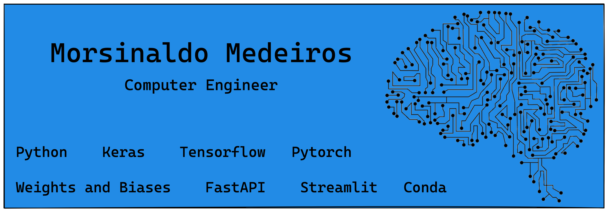

## Hi there 👋

My name is **Morsinaldo Medeiros** and I am graduating in **Computer Engineering** at the Federal University of Rio Grande do Norte (UFRN). I have a degree in **Computer Science** from the IFRN and I was the laureate of the class. I am currently just studying and working on research within the university in the field of Natural Language Processing (NLP). I have experience with Python, Tensorflow, Weights and Biases,SQL and other technologies related to MLOps.

---

<h3 align='center'>My articles on Medium</h3>

<!-- ARTICLES:START -->

- [Learn how to easily improve your neural network in practice](https://blog.devops.dev/learn-how-to-easily-improve-your-neural-network-in-practice-419e5402b4fa)

- [From classic models to production models (co-author)](https://medium.com/@alessandro.pereira.700/from-classic-models-to-production-models-8d4ab873ac4d)

- [From Notebooks to Scripts](https://medium.com/@morsinaldo.medeiros.075/from-notebooks-to-scripts-28332f3e93d9)

<!-- ARTICLES:END -->

---

- 🔭 I’m currently working as researcher at UFRN
- 🌱 I’m currently learning **Deep Learning with Pytorch and NLP**
- 👯 I’m looking to collaborate on commercial projects

- 💬 Ask me about **Data Science and Machine Learning**
- 📫 How to reach me: morsinaldo.medeiros.075@ufrn.edu.br

---

  

    
---
<h3 align="center">Languages and Tools</h3>

           

  
---

 
  
  
   

